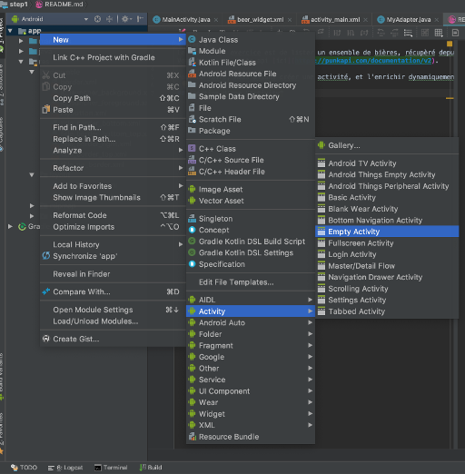

# Communication entre différents écran

Maintenant que vous maitrisez l'art de créer une "Activity". Vous allez pouvoir en créer une nouvelle qui représentera un écran de détail.

## Ma seconde Activity

Dans un premier temps vous allez donc créer une nouvelle activité.




Le but sera alors depuis la première activité, de démarrer la seconde.

Ajouter un écouteur sur l'une de vos vue :

```java
    maVue = findViewById(R.id.ma_vue_gerant_le_click);

    maVue.setOnClickListener(view -> maMethodeSurClick(view));
```

dans cet écouteur vous démarrerez la nouvelle acivité : 

```java
    Intent intent = new Intent(getContext(), MaNouvelleActivity.class);
    startActivity(intent);
``` 

Ceci démarre la nouvelle activité et la fait passer en foreground.

il faudrait désormais pouvoir passer des informations d'une activité vers l'autre, puisque l'on souhaiterait afficher un détail.

Vous pouvez utiliser la méthode putExtra disponible sur la classe Intent.
Juste avant l'appel à startActivity
`
```java
    intent.putExtra("MON_ID_DE_DONNES", mes_donnees);
```


dans l'activité enfant

```java
    @Override
    protected void onCreate(Bundle savedInstanceState) {
        ...
        Bundle b = getIntent().getExtras();
        String mes_donnees = b.getString("MON_ID_DE_DONNES");
        // et ainsi les utiliser pour remplir votre vue 
        ...
    }
